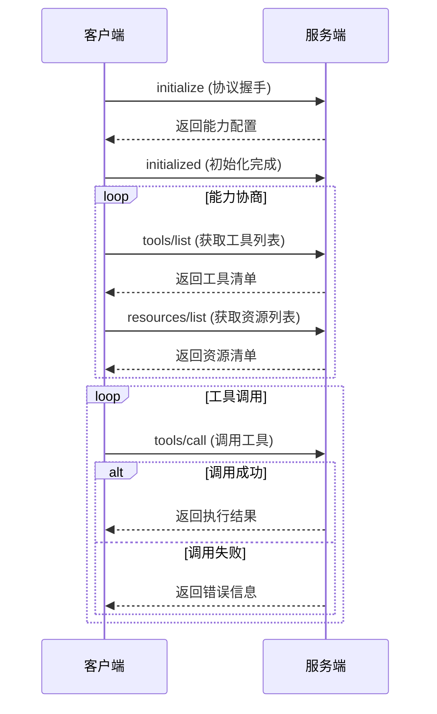

# MCP 服务端 JSON-RPC 交互流程

## MCP json-rpc 服务函数列表
- `initialize`: 客户端初始化请求
- `notifications/initialized`: 客户端初始化完成通知
- `notifications/progress`: 进度通知
- `resources/list`: 获取资源列表
- `resources/templates/list`: 获取资源模板列表
- `resources/read`: 读取资源内容
- `notifications/resources/list_changed`: 资源列表变更通知
- `resources/subscribe`: 订阅资源变更通知
- `resources/unsubscribe`: 取消订阅资源变更通知
- `notifications/resources/updated`: 资源更新通知
- `prompts/list`: 获取提示列表
- `prompts/get`: 获取提示内容
- `notifications/prompts/list_changed`: 提示列表变更通知
- `tools/list`: 获取工具列表
- `tools/call`: 调用工具
- `notifications/tools/list_changed`: 工具列表变更通知
- `logging/setLevel`: 设置日志级别
- `notifications/message`: 消息通知
- `sampling/createMessage`: 创建消息通知
- `completion/complete`: 获取补全建议
- `roots/list`: 获取根资源列表
- `notifications/roots/list_changed`: 根资源列表变更通知
- `notifications/cancelled`: 取消通知

## 1. 握手阶段
### 客户端初始化请求
```json
{
  "method": "initialize",
  "params": {
    "protocolVersion": "2024-11-05",  // 必填，协议版本号
    "capabilities": {                 // 客户端能力配置（可选）
      "experimental": {},             // 实验性功能配置
      "roots": {                      // 根能力配置
        "listChanged": true           // 启用列表变更通知
      }
    },
    "clientInfo": {                   // 客户端信息（可选）
      "name": "Cline",                // 客户端名称
      "version": "3.13.1"             // 客户端版本
    }
  },
  "jsonrpc": "2.0",
  "id": 0
}
```

### 服务端响应
```json
{
  "jsonrpc": "2.0",
  "id": 0,
  "result": {
    "protocolVersion": "2024-11-05",  // 协议版本号
    "capabilities": {                 // 服务端能力配置
      "prompts": {                    // 提示功能配置（可选）
        "listChanged": true           // 启用提示列表变更通知
      },
      "resources": {                  // 资源功能配置（可选）
        "subscribe": true,            // 启用资源订阅
        "listChanged": true           // 启用资源列表变更通知
      },
      "tools": {                      // 工具功能配置（可选）
        "listChanged": true           // 启用工具列表变更通知
      }
    },
    "serverInfo": {                   // 服务端信息
      "name": "rmcp",                 // 服务名称
      "version": "0.1.5"              // 服务版本
    },
    "instructions": "This server provides a counter tool..."  // 服务说明
  }
}
```

### 客户端初始化完成通知
```json
{
  "method": "notifications/initialized",
  "jsonrpc": "2.0"
}
```

## 2. 能力协商
### 工具列表获取
```json
{
  "method": "tools/list",
  "jsonrpc": "2.0",
  "id": 1
}
```

**服务端响应示例：**
```json
{
  "jsonrpc": "2.0",
  "id": 1,
  "result": {
    "tools": [
      {
        "name": "sum",
        "description": "Calculate the sum of two numbers",
        "inputSchema": {
          "$schema": "http://json-schema.org/draft-07/schema#",
          "type": "object",
          "properties": {
            "a": {"type": "integer", "format": "int32"},
            "b": {"type": "integer", "format": "int32"}
          },
          "required": ["a", "b"]
        },
        "annotations": {              // 工具注解（可选）
          "readOnlyHint": false,      // 是否只读操作
          "destructiveHint": true,    // 是否可能产生副作用
          "idempotentHint": true      // 是否幂等操作
        }
      }
    ]
  }
}
```

### 资源列表获取
```json
{
  "method": "resources/list",
  "jsonrpc": "2.0",
  "id": 2
}
```

**服务端响应示例：**
```json
{
  "jsonrpc": "2.0",
  "id": 2,
  "result": {
    "resources": [
      {
        "uri": "str:////Users/to/some/path/",  // 资源标识符
        "name": "cwd",                         // 资源名称
        "metadata": {                          // 元数据（可选）
          "type": "directory",                 // 资源类型
          "size": 4096                         // 资源大小
        }
      }
    ]
  }
}
```

## 3. 工具调用流程
### 简单调用示例
```json
{
  "method": "tools/call",
  "params": {
    "name": "say_hello",            // 工具名称
    "arguments": {}                 // 调用参数（根据工具schema）
  },
  "jsonrpc": "2.0",
  "id": 4
}
```

### 带参数调用示例
```json
{
  "method": "tools/call",
  "params": {
    "name": "sum",
    "arguments": {
      "a": 1023123,
      "b": 2352345
    }
  },
  "jsonrpc": "2.0",
  "id": 7
}
```

**成功响应：**
```json
{
  "jsonrpc": "2.0",
  "id": 7,
  "result": {
    "content": [{
      "type": "text",
      "text": "3375468"
    }],
    "isError": false,               // 是否错误状态
    "metadata": {                   // 响应元数据（可选）
      "executionTime": 12.3,        // 执行时间(ms)
      "resourceUsage": {            // 资源使用情况
        "memory": "256KB"           
      }
    }
  }
}
```

## 4. 交互流程图


## 字段说明表
| 字段路径 | 类型 | 必填 | 说明 |
|---------|------|-----|-----|
| params.capabilities.experimental | object | 否 | 实验性功能配置 |
| params.capabilities.roots.listChanged | boolean | 否 | 启用根资源变更通知 |
| result.capabilities.prompts.listChanged | boolean | 否 | 启用提示列表变更通知 |
| result.capabilities.resources.subscribe | boolean | 否 | 启用资源订阅功能 |
| annotations.readOnlyHint | boolean | 否 | 标识工具是否只读操作 |
| annotations.destructiveHint | boolean | 否 | 标识工具是否可能产生副作用 |
| result.metadata.executionTime | number | 否 | 工具执行耗时(毫秒) |
